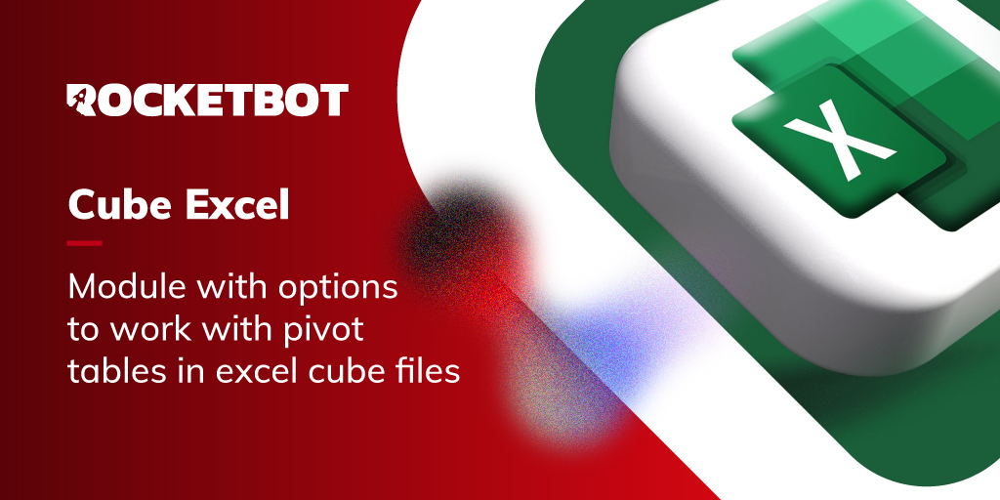

# Cube Excel
  
Módulo para actualizar, aplicar y limpiar con tablas dinámicas OLAP/Cubo de excel  

*Read this in other languages: [English](Manual_CubeExcel.md), [Português](Manual_CubeExcel.pr.md), [Español](Manual_CubeExcel.es.md)*
  

## Como instalar este módulo
  
Para instalar el módulo en Rocketbot Studio, se puede hacer de dos formas:
1. Manual: __Descargar__ el archivo .zip y descomprimirlo en la carpeta modules. El nombre de la carpeta debe ser el mismo al del módulo y dentro debe tener los siguientes archivos y carpetas: \__init__.py, package.json, docs, example y libs. Si tiene abierta la aplicación, refresca el navegador para poder utilizar el nuevo modulo.
2. Automática: Al ingresar a Rocketbot Studio sobre el margen derecho encontrara la sección de **Addons**, seleccionar **Install Mods**, buscar el modulo deseado y presionar install.  

## Descripción de los comandos

### Actualizar tabla dinámica
  
Actualiza una tabla dinámica
|Parámetros|Descripción|ejemplo|
| --- | --- | --- |
|Hoja |Nombre de la hoja donde se encuentra la tabla dinámica|Hoja 1|
|Nombre de la tabla dinámica |Nombre de la tabla dinámica|Name: |

### Agregar Campo - Cube
  
Agrega un campo a una tabla dinámica
|Parámetros|Descripción|ejemplo|
| --- | --- | --- |
|Hoja |Nombre de la hoja donde se encuentra la tabla dinámica|Hoja 1|
|Nombre de la tabla dinámica |Nombre de la tabla dinámica|Name: |
|Selecciona una opción|Selecciona lo que deseas agregar||
|Campo a agregar|Nombre del campo a agregar|[Field].[Subfield]: |

### Remover Campo - Cube
  
Remueve un campo de una tabla dinámica
|Parámetros|Descripción|ejemplo|
| --- | --- | --- |
|Hoja |Nombre de la hoja donde se encuentra la tabla dinámica|Hoja 1|
|Nombre de la tabla dinámica |Nombre de la tabla dinámica|Name: |
|Campo a agregar|Nombre del campo a agregar|[Field].[Subfield]: |

### Agregar filtro - Cube
  
Filtra una tabla dinámica
|Parámetros|Descripción|ejemplo|
| --- | --- | --- |
|Hoja |Nombre de la hoja donde se encuentra la tabla dinámica|Hoja 1|
|Nombre de la tabla dinámica |Nombre de la tabla dinámica|Name: |
|Filter |Filtro a aplicar|[Field].[SubField]: |
|Filtro abierto |Filtro abierto|[filter].[All filter].[data].[more data]: |

### Aplicar filtro - Cube
  
Filtra una tabla dinámica
|Parámetros|Descripción|ejemplo|
| --- | --- | --- |
|Hoja |Nombre de la hoja donde se encuentra la tabla dinámica|Hoja 1|
|Nombre de la tabla dinámica |Nombre de la tabla dinámica|Name: |
|Filter |Filtro a aplicar|[Field].[SubField]: |
|Filtro abierto |Filtro abierto|Filtro a aplicar: |
|Numero como texto||False|

### Limpiar filtro - Cube
  
Limpiar un filtro de una tabla dinámica
|Parámetros|Descripción|ejemplo|
| --- | --- | --- |
|Hoja |Nombre de la hoja donde se encuentra la tabla dinámica|Hoja 1|
|Nombre de la tabla dinámica |Nombre de la tabla dinámica|Name: |
|Filter |Filtro a aplicar|[Field].[SubField]: |

### Limpiar todos los filtros - Cube
  
Limpiar todos los filtros de una tabla dinámica
|Parámetros|Descripción|ejemplo|
| --- | --- | --- |
|Hoja |Nombre de la hoja donde se encuentra la tabla dinámica|Hoja 1|
|Nombre de la tabla dinámica |Nombre de la tabla dinámica|Name: |

### Listar Items Visibles - Cubo
  
Lista items visibles de un campo de una Tabla Dinamica - Cubo
|Parámetros|Descripción|ejemplo|
| --- | --- | --- |
|Hoja |Nombre de la hoja donde se encuentra el campo|Hoja 1|
|Nombre de la tabla dinámica |Nombre de la tabla dinámica donde se encuentra el campo|Name: |
|Campo |Nombre del campo|[Field]: |
|Asignar resultado a variable|Nombre de la variable donde se almacenará el resultado|Variable|

### Abrir Campo
  
Abre un campo. Similar a hacer click en botón más
|Parámetros|Descripción|ejemplo|
| --- | --- | --- |
|Hoja |Nombre de la hoja|Hoja 1|
|Nombre de la tabla dinámica |Nombre de la tabla dinámica|Name: |
|Campo |Nombre del campo|[Field].[type]: |
|Campo celda |Nombre del campo de celda|[Field].[All Field].[cell name].[other cell name]: |

### Listar Campos
  
Lista todos los campos disponibles
|Parámetros|Descripción|ejemplo|
| --- | --- | --- |
|Hoja |Nombre de la hoja|Hoja 1|
|Nombre de la tabla dinámica |Nombre de la tabla dinámica|Name: |
|Asignar resultado a variable|Nombre de la variable donde se almacenará el resultado|Variable|

### Listar SubCampo
  
Lista todos los campos dinámicos de un campo Cube
|Parámetros|Descripción|ejemplo|
| --- | --- | --- |
|Hoja |Nombre de la hoja donde se encuentra el campo|Hoja 1|
|Nombre de la tabla dinámica |Nombre de la tabla dinámica donde se encuentra el campo|Name: |
|Campo |Nombre del campo|[Field]: |
|Asignar resultado a variable|Nombre de la variable donde se almacenará el resultado|Variable|
